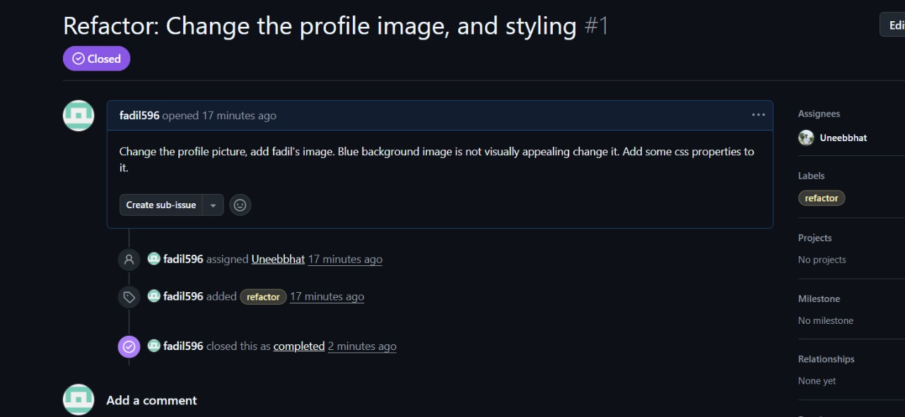

# Modern CV Builder

A professional CV builder web application that helps users create and maintain their resumes with a modern, responsive design.

## 🚀 Features

- **Modern Design**: Clean and professional layout with responsive design
- **Easy to Use**: Simple HTML/CSS structure for easy customization
- **Professional Styling**:
  - Responsive layout
  - Modern color scheme
  - Card-based design
  - Circular profile image
  - Hover effects on interactive elements
- **Well-Structured Content**:
  - Professional summary section
  - Social media integration
  - Education and experience sections
  - Skills and competencies

## 📸 Screenshots



## 🛠️ Technologies Used

- HTML5
- CSS3
- Git/GitHub for version control

## 🏃‍♂️ How to Run

1. Clone the repository:

   ```bash
   git clone https://github.com/your-username/oss-task-2.git
   ```

2. Navigate to the project directory:

   ```bash
   cd oss-task-2
   ```

3. Open `index.html` in your web browser to view the CV.

## 📁 Project Structure

```
oss-task-2/
├── index.html          # Main HTML file
├── css/
│   └── style.css      # Stylesheet
├── assets/
│   └── fadil.jpeg     # Profile image
└── README.md          # Project documentation
```

## 👥 Team Members

### Uneeb Bhatti

- **Role**: Frontend Developer
- **Contributions**:
  - Initial CV structure
  - HTML implementation
  - Basic styling

### Fadil Tanveer

- **Role**: Frontend Developer
- **Contributions**:
  - Design improvements
  - CSS styling
  - Code review

## 🔄 Git Workflow

1. Fork the repository
2. Create a new branch for features
3. Make changes and commit
4. Push to your fork
5. Create a Pull Request
6. Code review and merge

## 📝 Git Skills Demonstrated

- Repository forking
- Branch management
- Commit messages
- Pull requests
- Code review
- Collaboration

## 🎯 Learning Outcomes

- Git/GitHub collaboration
- HTML/CSS best practices
- Responsive web design
- Version control workflow
- Team collaboration

## 📄 License

This project is open source and available under the [MIT License](LICENSE).

## 🤝 Contributing

1. Fork the repository
2. Create your feature branch (`git checkout -b feature/AmazingFeature`)
3. Commit your changes (`git commit -m 'Add some AmazingFeature'`)
4. Push to the branch (`git push origin feature/AmazingFeature`)
5. Open a Pull Request

## 📧 Contact

Project Link: [https://github.com/Uneebbhat/oss-task-2.git](https://github.com/Uneebbhat/oss-task-2.git)
